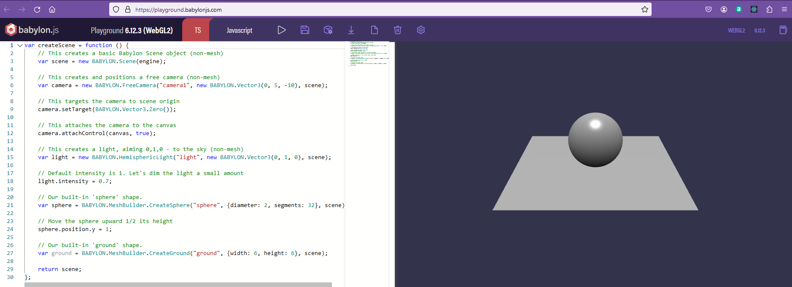
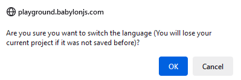
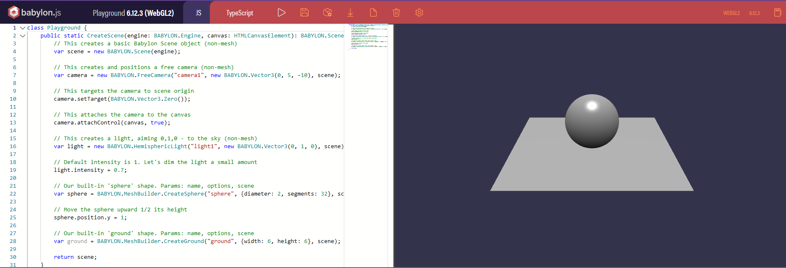
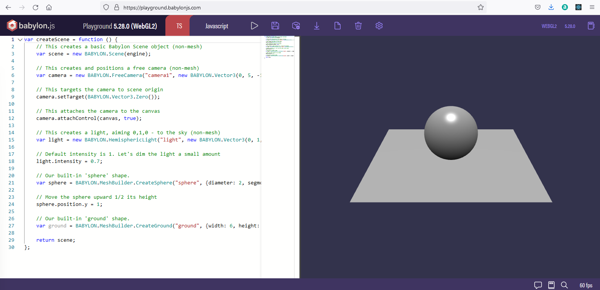

## Babyon introduction

### Documentation

The documentation for babylonjs is at [https://doc.babylonjs.com/journey](https://doc.babylonjs.com/journey).  This first link [https://doc.babylonjs.com/journey/theFirstStep](https://doc.babylonjs.com/journey/theFirstStep) describes the first step.

### Playground
The first piece of advice given is then to open up an example playground page in a seperate tab page pointing at the babylon.js playground at [https://playground.babylonjs.com/](https://playground.babylonjs.com/).  This presents a basic scene with a grond and a sphere.  The code shown here is javascript.



### Language choice

If you click on the red TS icon you will be invited to change language.



Take ok and see the Typescript version of the code.



You will see that the code is not so different.  [Typescript](https://www.typescriptlang.org/) is a superset of JavaScript which adds features which help you to write code with fewer errors.

When typescript is run it transcompiles into javascript.  This happens behind the scenes providing you are operating in a node environment and have all the supporting modules loaded.  

At the moment the focus is on creating scenes using code.  In the future, once the code is understood, a babylon editor can speed up the process.  This editor produces typescript and that is why typescript is preferred for learning babylon code rather than javascript.  However, until the typescript environment has been set up the first demo pages can be generated using javaScript.


So click on the blue JS icon in the playground to return to javascript.

### Detailed Scene

The playground is a place where code snippets can be developed.  Each snippet created will have a unique identifier.  Appending this to the URL will allow you to access the saved snippet.  An example of a snippet which demonstrates the rendering capability of babylon js can be found at [https://playground.babylonjs.com/#P1RZV0](https://playground.babylonjs.com/#P1RZV0).  The code is displayed alongside the scene.  Possibly Hamburg station.  You can drag on the image in the playground to look around the 3D scene and notice refraction in the bottle and a partial transparent shadow.


### Playground Scene

The default image on the playground site is a sphere floating above a ground plane.  The code displayed with this shows the createScene function.



The createScene function is the interesting thing here, it contains a camera, a light, a sphere and the ground.

``` javascript
var createScene = function () {
    // This creates a basic Babylon Scene object (non-mesh)
    var scene = new BABYLON.Scene(engine);

    // This creates and positions a free camera (non-mesh)
    var camera = new BABYLON.FreeCamera("camera1", new BABYLON.Vector3(0, 5, -10), scene);

    // This targets the camera to scene origin
    camera.setTarget(BABYLON.Vector3.Zero());

    // This attaches the camera to the canvas
    camera.attachControl(canvas, true);

    // This creates a light, aiming 0,1,0 - to the sky (non-mesh)
    var light = new BABYLON.HemisphericLight("light", new BABYLON.Vector3(0, 1, 0), scene);

    // Default intensity is 1. Let's dim the light a small amount
    light.intensity = 0.7;

    // Our built-in 'sphere' shape.
    var sphere = BABYLON.MeshBuilder.CreateSphere("sphere", {diameter: 2, segments: 32}, scene);

    // Move the sphere upward 1/2 its height
    sphere.position.y = 1;

    // Our built-in 'ground' shape.
    var ground = BABYLON.MeshBuilder.CreateGround("ground", {width: 6, height: 6}, scene);
    

    return scene;
};
```
The documentation takes you through editing the code in playground to show a Yeti on a chequerboard. Give that a try!

However what you are working with in playground is a function which returns a scene.  Where is the function called?  This is useful, but it is not the complete code.  Playground adds in extra code behind the scenes.  This is the fairly repetetive code needed to render the scene.

Code can be downloaded as a zip file from playground.  On unzipping a file index,html can be inspected which contains the full code needed to display the demo.

This includes a collection of script links to load in the required BabylonJS framework code, a stylesheet section to control the size of a canvas, script to manage a render loop, the createScene() function (as presented on the playground) and the initialisation of an engine.


``` html
<!DOCTYPE html>
<html>
    <head>
        <meta http-equiv="Content-Type" content="text/html; charset=utf-8" />

        <title>Babylon.js sample code</title>

        <!-- Babylon.js -->
        <script src="https://cdnjs.cloudflare.com/ajax/libs/dat-gui/0.6.2/dat.gui.min.js"></script>
        <script src="https://assets.babylonjs.com/generated/Assets.js"></script>
        <script src="https://cdn.babylonjs.com/recast.js"></script>
        <script src="https://cdn.babylonjs.com/ammo.js"></script>
        <script src="https://cdn.babylonjs.com/havok/HavokPhysics_umd.js"></script>
        <script src="https://cdn.babylonjs.com/cannon.js"></script>
        <script src="https://cdn.babylonjs.com/Oimo.js"></script>
        <script src="https://cdn.babylonjs.com/earcut.min.js"></script>
        <script src="https://cdn.babylonjs.com/babylon.js"></script>
        <script src="https://cdn.babylonjs.com/materialsLibrary/babylonjs.materials.min.js"></script>
        <script src="https://cdn.babylonjs.com/proceduralTexturesLibrary/babylonjs.proceduralTextures.min.js"></script>
        <script src="https://cdn.babylonjs.com/postProcessesLibrary/babylonjs.postProcess.min.js"></script>
        <script src="https://cdn.babylonjs.com/loaders/babylonjs.loaders.js"></script>
        <script src="https://cdn.babylonjs.com/serializers/babylonjs.serializers.min.js"></script>
        <script src="https://cdn.babylonjs.com/gui/babylon.gui.min.js"></script>
        <script src="https://cdn.babylonjs.com/inspector/babylon.inspector.bundle.js"></script>

        <style>
            html, body {
                overflow: hidden;
                width: 100%;
                height: 100%;
                margin: 0;
                padding: 0;
            }

            #renderCanvas {
                width: 100%;
                height: 100%;
                touch-action: none;
            }
            
            #canvasZone {
                width: 100%;
                height: 100%;
            }
        </style>
    </head>
<body>
    <div id="canvasZone"><canvas id="renderCanvas"></canvas></div>
    <script>
        var canvas = document.getElementById("renderCanvas");

        var startRenderLoop = function (engine, canvas) {
            engine.runRenderLoop(function () {
                if (sceneToRender && sceneToRender.activeCamera) {
                    sceneToRender.render();
                }
            });
        }

        var engine = null;
        var scene = null;
        var sceneToRender = null;
        var createDefaultEngine = function() { return new BABYLON.Engine(canvas, true, { preserveDrawingBuffer: true, stencil: true,  disableWebGL2Support: false}); };
        var createScene = function () {
    // This creates a basic Babylon Scene object (non-mesh)
    var scene = new BABYLON.Scene(engine);

    // This creates and positions a free camera (non-mesh)
    var camera = new BABYLON.FreeCamera("camera1", new BABYLON.Vector3(0, 5, -10), scene);

    // This targets the camera to scene origin
    camera.setTarget(BABYLON.Vector3.Zero());

    // This attaches the camera to the canvas
    camera.attachControl(canvas, true);

    // This creates a light, aiming 0,1,0 - to the sky (non-mesh)
    var light = new BABYLON.HemisphericLight("light", new BABYLON.Vector3(0, 1, 0), scene);

    // Default intensity is 1. Let's dim the light a small amount
    light.intensity = 0.7;

    // Our built-in 'ground' shape.
    var ground = BABYLON.MeshBuilder.CreateGround("ground", {width: 6, height: 6}, scene);
    let groundMaterial = new BABYLON.StandardMaterial("Ground Material", scene);
    ground.material = groundMaterial;
    let groundTexture = new BABYLON.Texture(Assets.textures.checkerboard_basecolor_png.rootUrl, scene);
    ground.material.diffuseTexture = groundTexture;

    BABYLON.SceneLoader.ImportMesh("", Assets.meshes.Yeti.rootUrl, Assets.meshes.Yeti.filename, scene, function(newMeshes){
        newMeshes[0].scaling = new BABYLON.Vector3(0.1, 0.1, 0.1);
    });

    return scene;
};
                window.initFunction = async function() {
                    
                    
                    
                    var asyncEngineCreation = async function() {
                        try {
                        return createDefaultEngine();
                        } catch(e) {
                        console.log("the available createEngine function failed. Creating the default engine instead");
                        return createDefaultEngine();
                        }
                    }

                    window.engine = await asyncEngineCreation();
        if (!engine) throw 'engine should not be null.';
        startRenderLoop(engine, canvas);
        window.scene = createScene();};
        initFunction().then(() => {sceneToRender = scene                    
        });

        // Resize
        window.addEventListener("resize", function () {
            engine.resize();
        });
    </script>
</body>
</html>

```
Download and unzip this file and click on it in the file inspector to check that it runs.

## Developing locally

You can work on BabylonJS using just an editor and a browser drawing all the babylonJS contet in from a content delivery network.  I don't recommend this as a way of working, but you may see reference to this online so it is as well to know what it is.  Review this and then move swiftly on to use vite. To work on babylonJS locally, in javaScript for starters, all this code will be needed.  It is useful to separate the repetetive code and the specific scene code into separate files.  Later a pattern for project organisation will be set up which allows for expansion to larger projects.  For now code is split up into hello.html, top.js, main.js and bottom.js all within a single folder.

### hello.html

If you want to edit code in visual studio code you will need to add in the necessary standard code around the createScene function and all of this will need to sit inside an HTML file.

**hello.html**
```html
<!DOCTYPE html>
<html>
    <head>
        <meta http-equiv="Content-Type" content="text/html; charset=utf-8" />

        <title>Babylon.js sample code</title>

        <!-- Babylon.js -->
 
        <script src="https://cdnjs.cloudflare.com/ajax/libs/dat-gui/0.6.2/dat.gui.min.js"></script>
        <script src="https://assets.babylonjs.com/generated/Assets.js"></script>
        <script src="https://cdn.babylonjs.com/ammo.js"></script>
        <script src="https://cdn.babylonjs.com/cannon.js"></script>
        <script src="https://cdn.babylonjs.com/Oimo.js"></script>
        <script src="https://cdn.babylonjs.com/earcut.min.js"></script>
        <script src="https://cdn.babylonjs.com/babylon.js"></script>
        <script src="https://cdn.babylonjs.com/materialsLibrary/babylonjs.materials.min.js"></script>
        <script src="https://cdn.babylonjs.com/proceduralTexturesLibrary/babylonjs.proceduralTextures.min.js"></script>
        <script src="https://cdn.babylonjs.com/postProcessesLibrary/babylonjs.postProcess.min.js"></script>
        <script src="https://cdn.babylonjs.com/loaders/babylonjs.loaders.js"></script>
        <script src="https://cdn.babylonjs.com/serializers/babylonjs.serializers.min.js"></script>
        <script src="https://cdn.babylonjs.com/gui/babylon.gui.min.js"></script>
        <script src="https://cdn.babylonjs.com/inspector/babylon.inspector.bundle.js"></script>
    

        <style>
            html,
            body {
                overflow: hidden;
                width: 100%;
                height: 100%;
                margin: 0;
                padding: 0;
            }

            #renderCanvas {
                width: 100%;
                height: 100%;
                touch-action: none;
            }

            
        </style>
    </head>

    <body>
        <canvas id="renderCanvas"></canvas>
        <script src="top.js"></script>
        <script src="main.js"></script>
        <script src="bottom.js"></script>
    </body>
</html>
```

The script lines in the head load elements of the babylon.js library.  The full library can be loaded in a single line, however it is more efficient to add aspects individually so that only those sections of the library which are required for a scene are loaded.  This makes for a longer file to read, but a shorter download.

Below this some cascading stylesheet style is added and you are free to modify this.  The # sign indicates style which will only be applied to the single HTML element which has id="renderCanvas".

BabylonJS relies on [WebGL](https://www.khronos.org/api/webgl) to provide a low level 3D graphic API which can be accessed by javaScript and displayed within an HTML canvas.  WebGL is supported by major browsers including Apple (Safari), Google (Chrome), Microsoft (Edge), and Mozilla (Firefox).  So 3D is supported in the browser without the need for any further plugin software.

The `<body></body>` of the page is quite simple.  A `<canvas>` element will provide an area which can render an image described in WGL and this will be referenced by the unique identifier id="renderCanvas".

Below this are three sections of script.  Having these in separate files means that you can concentrate on the scene code in main.js while the other files have standard code which you can reuse.  As we refactor code later, these scripts will be organised into a more useable file structure, but for now:

### top.js

The first script **top.js** reads the HTML (hyper text markup language ) DOM (document object model) to reference the renderCanvas by a javascript global variable named "canvas".

```javascript
var canvas = document.getElementById("renderCanvas");
```

A function is defined and referenced by a global variable named "startRenderLoop".  When called with arguments of graphic engine and canvas this will first check that there is a valid scene referrenced by the "sceneToRender" variable and that this scene has an active camera.  If these both exist the scene will be rendered by the engines render loop at the default video frame rate.

```javascript
var startRenderLoop = function (engine, canvas) {
    engine.runRenderLoop(function () {
        if (sceneToRender && sceneToRender.activeCamera) {
            sceneToRender.render();
        }
    });
};
```

The engine and the scene to be rendered to are not yet defined, but null variables can be created to reference them when they have been defined.


```javaScript
var engine = null;
var scene = null;
var sceneToRender = null;
```


A function is defined which will use the built in BABYLON.Engine constructor function to link the engine to the specified canvas and configure the support for WebGL features.

At this stage functions have been defined, but not yet called.

```javaScript
var createDefaultEngine = function () {
    return new BABYLON.Engine(canvas, true, {
        preserveDrawingBuffer: true,
        stencil: true,
        disableWebGL2Support: false,
    });
};
```


The full listing of **top.js** is:

**top.js**
```JavaScript
var canvas = document.getElementById("renderCanvas");

var startRenderLoop = function (engine, canvas) {
    engine.runRenderLoop(function () {
        if (sceneToRender && sceneToRender.activeCamera) {
            sceneToRender.render();
        }
    });
};

var engine = null;
var scene = null;
var sceneToRender = null;
var createDefaultEngine = function () {
    return new BABYLON.Engine(canvas, true, {
        preserveDrawingBuffer: true,
        stencil: true,
        disableWebGL2Support: false,
    });
};
```
### main.js

In the main section of the javascript a createScene function is defined which will return a constant scene object .  Features such as camera, light and shapes are added to the scene.  As code is refactored, the createScene process will be altered to adopt a functional approach.

Note that createScene is an asynchronous function

```javaScript
var createScene = async function () {
```
The scene is created using the built in BABYLON constructor function Scene() which takes the graphics engine as a parameter.
The scene can be set to show inspector areas to left and right by showing the debuglayer.

```javaScript
    const scene = new BABYLON.Scene(engine);
    scene.debugLayer.show();
```

To see anything a camera must be added to the scene.  Here the parameters alpha, beta and radius locate the camera with respect to the target which it is pointed at.  The format of the parameters is: 
`new ArcRotateCamera(name: string, alpha: number, beta: number, radius: number, target: Vector3, scene?: Scene, setActiveOnSceneIfNoneActive?: boolean)` where scene and set activeOnSceneIf NoneActive are optional.

To allow the camera to move in response to keypress or touch the camera control must be attached to the canvas.

```javaScript
    const camera = new BABYLON.ArcRotateCamera("camera", -Math.PI / 2, Math.PI / 2.5, 3, new BABYLON.Vector3(0, 0, 0),scene);

    camera.attachControl(canvas, true);
```

The scene would be dark without a light to illuminate it.  The hemispheric light is a basic starter.

`new HemisphericLight(name: string, direction: Vector3, scene: Scene)`

```javaScript
    const light = new BABYLON.HemisphericLight("light", new BABYLON.Vector3(0, 1, 0), scene);
```

The BABYLON meshBuilder allows standard shaped meshes to be created.  The general parameters are `(name, options, scene)` where multiple options are expressed as JSON objects and the scene is optional (defaulting to the current scene if omitted).

Adding a box, a sphere and a ground plane:

```javascript
    const box = BABYLON.MeshBuilder.CreateBox("box", {}, scene);

    box.position.y = 3;

    var sphere = BABYLON.MeshBuilder.CreateSphere("sphere", { diameter: 2, segments: 32 }, scene);

    sphere.position.y = 1;

    var ground = BABYLON.MeshBuilder.CreateGround("ground", { width: 6, height: 6 }, scene);

```

The last line of the createscene function returns the assembled scene.
```javaScript
    return scene;
};
```
A function has now been defined but it has not yet been called.


The full listing of **main.js** is:

**main.js** 
```javascript
var createScene = async function () {
    const scene = new BABYLON.Scene(engine);
    scene.debugLayer.show();

    const camera = new BABYLON.ArcRotateCamera("camera", -Math.PI / 2, Math.PI / 2.5, 3, new BABYLON.Vector3(0, 0, 0),scene);

    camera.attachControl(canvas, true);

    const light = new BABYLON.HemisphericLight("light", new BABYLON.Vector3(0, 1, 0), scene);

    light.intensity = 0.7;

    const box = BABYLON.MeshBuilder.CreateBox("box", {}, scene);

    box.position.y = 3;

    var sphere = BABYLON.MeshBuilder.CreateSphere("sphere", { diameter: 2, segments: 32 }, scene);

    sphere.position.y = 1;

    var ground = BABYLON.MeshBuilder.CreateGround("ground", { width: 6, height: 6 }, scene);

    return scene;
};
```

### bottom.js

So far functions and variables have been defined.  The last piece of code in bottom.js will call these functions and initialise the page.

The async functions included here reflect the asynchronous nature of their operation.  The async function will return a promise to the window.initfunctin

```javascript
window.initFunction = async function () {
```
An async function is defined and referenced by the asyncEngineCreation variable.  This tries to create and return a default engine.  The `try ... catch` structure handles errors, but does not do much except send a warning console log message here.

```javaScript
    var asyncEngineCreation = async function () {
        try {
            return createDefaultEngine();
        } catch (e) {
            console.log("the available createEngine function failed. Creating the default engine instead");
            return createDefaultEngine();
        }
    };
```
.When window,initfunction is called it will fo on to execute the function referenced as asyncEngineCreation. The resulte is `await`ed and the returned default engine is referenced by window.engine.

If an engine has not been created an error message is thrown.

Now the render loop can be started acting on the returned engine and the canvas.

Finally the scene returned by createScene is displayed as the window.scene.


```javaScript
    window.engine = await asyncEngineCreation();
    if (!engine) throw "engine should not be null.";
    startRenderLoop(engine, canvas);
    window.scene = createScene();
};
```

That completes the definition of window.initFunction.  Next this function is called and since it returns a promise the `then` keyword is used to fulfil this and the returned scene is assigned to the scene global variable.

```javaScript
initFunction().then(() => {
    scene.then((returnedScene) => {
        sceneToRender = returnedScene;
    });
});
```

The last code lines allow the displayed window to be resizeable.

```javaScript
// Resize
window.addEventListener("resize", function () {
    engine.resize();
});
```

Much of this code will be common to all projects and so can be regarded as boilerplate although it will be refactored later.

A full listing of **bottom.js**:

**bottom.js**
```javascript
window.initFunction = async function () {
    var asyncEngineCreation = async function () {
        try {
            return createDefaultEngine();
        } catch (e) {
            console.log("the available createEngine function failed. Creating the default engine instead");
            return createDefaultEngine();
        }
    };

    window.engine = await asyncEngineCreation();
    if (!engine) throw "engine should not be null.";
    startRenderLoop(engine, canvas);
    window.scene = createScene();
};

initFunction().then(() => {
    scene.then((returnedScene) => {
        sceneToRender = returnedScene;
    });
});

// Resize
window.addEventListener("resize", function () {
    engine.resize();
});
```

### Display

The resulting html page is then displayed.  The inspector and scene explorer are dynamic.  You can close them to see the full scene.  Note as well that the hamburger icon at the bottom of the left sidebar can be clicked to hide navigation links and view the full page.

<iframe 
    height="600" 
    width="100%" 
    scrolling="no" 
    title="Hello Page" 
    src="Block_3/section_1/Hello/Hello.html" 
    frameborder="no" 
    loading="lazy" 
    allowtransparency="true" 
    allowfullscreen="true">
</iframe>


