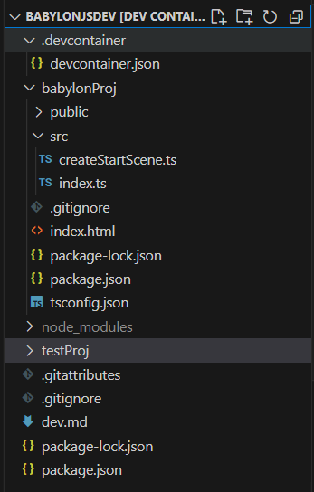
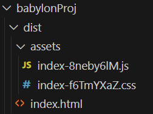
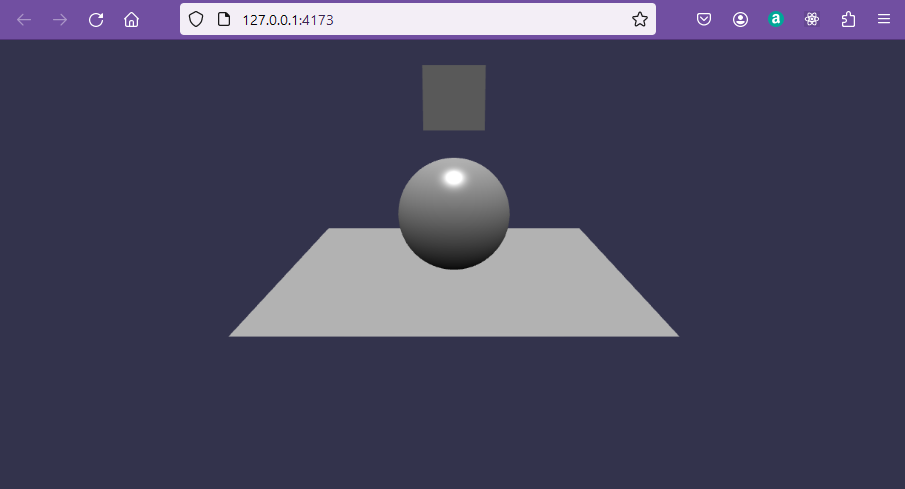
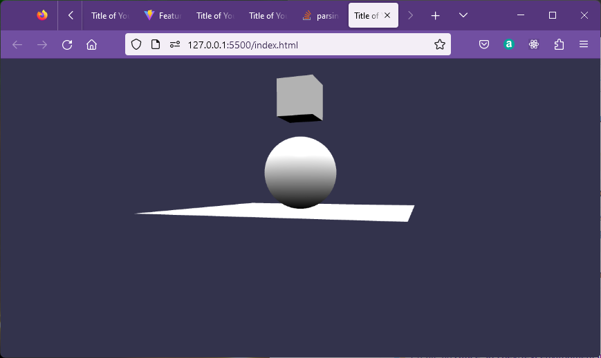

## Running babylon on Vite

You can keep the test project folder later reference.  Never copy the node modules, they are easily restored when needed.

* Create a new folder named babylonProj in the babylonJSdev folder.

* Copy the files .gitignore, package-lock.json and package.json from testProj into babylonProj


Add the following file named tsconfig.json to babylonProj

**tsconfig.json**
```json
{
  "compilerOptions": {
    "target": "es6", // choose our ECMA/JavaScript version (all modern browsers support ES6 so it's your best bet)
    "lib": [ // choose our default ECMA/libraries to import
      "dom", // mandatory for all browser-based apps
      "es6" // mandatory for targeting ES6
    ],
    "useDefineForClassFields": true, // enable latest ECMA runtime behavior with older ECMA/JavaScript versions (delete this line if target: "ESNext" or "ES2022"+)
    "module": "ESNext", // use the latest ECMA/JavaScript syntax for our import statements and such
    "moduleResolution": "node", // ensures we are using CommonJS for our npm packages
    "noResolve": false, // disable TypeScript from automatically detecting/adding files based on import statements and etc (it's less helpful than you think)
    "isolatedModules": true, // allows our code to be processed by other transpilers, such as preventing non-module TS files (you could delete this since we're only using base TypeScript)
    "removeComments": true, // remove comments from our outputted code to save on space (look into terser if you want to protect the outputted JS even more)
    "esModuleInterop": true, // treats non-ES6 modules separately from ES6 modules (helpful if module: "ESNext")
    "noImplicitAny": false, // usually prevents code from using "any" type fallbacks to prevent untraceable JS errors, but we'll need this disabled for our example code
    "noUnusedLocals": false, // usually raises an error for any unused local variables, but we'll need this disabled for our example code
    "noUnusedParameters": true, // raises an error for unused parameters
    "noImplicitReturns": true, // raises an error for functions that return nothing
    "skipLibCheck": true // skip type-checking of .d.ts files (it speeds up transpiling)
  },
  "include": ["src"] // specify location(s) of .ts files
}
```


Comments are not normally used in json files, but may be used with typescript.
The TSConfig referenc can be found [here](https://www.typescriptlang.org/tsconfig).


Add this index.html file to babylonProj:

**index.html**
```html
<!DOCTYPE html>
<html>
    <head>
        <meta charset="UTF-8">
        <title>Title of Your Project</title>
    </head>
    <body> </body>
</html>
<script type="module" src="./src/index.ts"></script>
```

Add an empty public folder and an empty src folder to babylonProj.


Now create index.ts and createStartScene.ts inside babylonProj/src to display a simple scene.

**babylonProj/src/index.ts**
```javascript
import { Engine } from "@babylonjs/core";
import createStartScene from "./createStartScene";
import './main.css';

const CanvasName = "renderCanvas";

let canvas = document.createElement("canvas");
canvas.id = CanvasName;

canvas.classList.add("background-canvas");
document.body.appendChild(canvas);

let eng = new Engine(canvas, true, {}, true);
let startScene = createStartScene(eng);
eng.runRenderLoop(() => {
    startScene.scene.render();
});                  
```
Also add the createStartScene.ts module for the scene details.

**babylonProj/src/createStartScene.ts**
```javascript
import "@babylonjs/core/Debug/debugLayer";
import "@babylonjs/inspector";
import {
    Scene,
    ArcRotateCamera,
    Vector3,
    HemisphericLight,
    MeshBuilder,
    Mesh,
    Light,
    Camera,
    Engine,
  } from "@babylonjs/core";
  
  
  function createBox(scene: Scene) {
    let box = MeshBuilder.CreateBox("box",{size: 1}, scene);
    box.position.y = 3;
    return box;
  }

  
  function createLight(scene: Scene) {
    const light = new HemisphericLight("light", new Vector3(0, 1, 0), scene);
    light.intensity = 0.7;
    return light;
  }
  
  function createSphere(scene: Scene) {
    let sphere = MeshBuilder.CreateSphere(
      "sphere",
      { diameter: 2, segments: 32 },
      scene,
    );
    sphere.position.y = 1;
    return sphere;
  }
  
  function createGround(scene: Scene) {
    let ground = MeshBuilder.CreateGround(
      "ground",
      { width: 6, height: 6 },
      scene,
    );
    return ground;
  }
  
  function createArcRotateCamera(scene: Scene) {
    let camAlpha = -Math.PI / 2,
      camBeta = Math.PI / 2.5,
      camDist = 10,
      camTarget = new Vector3(0, 0, 0);
    let camera = new ArcRotateCamera(
      "camera1",
      camAlpha,
      camBeta,
      camDist,
      camTarget,
      scene,
    );
    camera.attachControl(true);
    return camera;
  }
  
  export default function createStartScene(engine: Engine) {
    interface SceneData {
      scene: Scene;
      box?: Mesh;
      light?: Light;
      sphere?: Mesh;
      ground?: Mesh;
      camera?: Camera;
    }
  
    let that: SceneData = { scene: new Scene(engine) };
    that.scene.debugLayer.show();
  
    that.box = createBox(that.scene);
    that.light = createLight(that.scene);
    that.sphere = createSphere(that.scene);
    that.ground = createGround(that.scene);
    that.camera = createArcRotateCamera(that.scene);
    return that;
  }
```

Now add the stylesheet file main.css inside babylonProj/src .

**babylonProj/src/main.css**
```css
body {
    overflow: hidden;
    width: 100%;
    height: 100%;
    margin: 0;
    padding: 0;
}

#renderCanvas {
    width: 100%;
    height: 100%;
}
```


At this point the file structure should be:



No files should be highligted in red and no lines should be underlined in red.  These are indications which Typescript adds to highlight errors!

Now to run this project, change the directory that the terminal is addressing:

Click on the folder babylonProj and "open in integrated terminal".

This is done rather than cd into the folder so that any installation will be separate from the parent folder.  However the node modules from the parent folder are known to the system and so installations will not be duplicated.

There are now two terminals running and it is easy to move between root and project terminals.

Check that the terminal prompt is now in the correct folder

```bash
node ➜ /workspaces/babylonJSdev/babylonProj (main) $
```

Now install the files required by package.json in the project folder.

>npm install

To run the project on the vite development server:

> npm run dev

View in browser:


To close the application in the terminal.

>CTRL + C

### Error fixing

If you encounter EOI error -5 at any point this means that the container is no longer in step with the edited file.

Don't change the contents from the file explorer while a container is running.

It is easy to come back to local editing by CTL shift P and choosing Dev Containers: reopen file locally. (This can sometinmes clear some typescript errors which have been fixed but still appearn highlighted red.)

If you see these errors.  Close and destroy the container and restart the PC.

### Comments on operation

Note that the function returns a variable of type SceneData which contains the scene and the individual scene elements.  That is to make these scene elements available for manipulation more easily in the module importing this one.

However,  the scene still works if the individual objects are not passed back with the scene.  So for instance editing createStartScene.ts to remove the comented lines and add the shorter lines will still work.

```javascript
    //that.box = createBox(that.scene);
    //that.light = createLight(that.scene);
    //that.sphere = createSphere(that.scene);
    //that.ground = createGround(that.scene);
    //that.camera = createArcRotateCamera(that.scene);

    createBox(that.scene);
    createLight(that.scene);
    createSphere(that.scene);
    createGround(that.scene);
    createArcRotateCamera(that.scene);
    return that;
```

Passing back the objects with the scene is a pattern intended to make the objects individually accessible later.  Its usefulness will depend on context.

Note also that because the babylon framework has been imported it is no longer necessary to use the BABYLON keyword in lines such as

```javascript
let box = MeshBuilder.CreateBox("box",{size: 1}, scene);
```

Typescript demands stricter syntax than javaScript, that is one way in which it reduces errors.

You must ensure that all the elements added to the variable that are included in the interface.  If you decide to add a new shape that must be in the interface as well.  However the use of ? means optional so if you decide to remove the box the interface will not complain that it is missing.

**babylonProj/src/createStartscene.ts**
```javascript
 export default function createStartScene(engine: Engine) {
    interface SceneData {
      scene: Scene;
      box?: Mesh;
      light?: Light;
      sphere?: Mesh;
      ground?: Mesh;
      camera?: Camera;
    }
  
    let that: SceneData = { scene: new Scene(engine) };
    that.scene.debugLayer.show();
  
    that.box = createBox(that.scene);
    that.light = createLight(that.scene);
    that.sphere = createSphere(that.scene);
    that.ground = createGround(that.scene);
    that.camera = createArcRotateCamera(that.scene);
    return that;
  }
```

## Building and deployment

Close the running application.

>CTRL + C

Remove the inspector from the finished code in createStartscene.ts.

```javascript
// import "@babylonjs/core/Debug/debugLayer";
// import "@babylonjs/inspector";
```
and 

```javascript
    // that.scene.debugLayer.show();
```

Issue the build command.

>npm run build

```bash
> testproj@0.0.0 build
> tsc && vite build

vite v5.3.1 building for production...
✓ 1696 modules transformed.
dist/index.html                      0.31 kB │ gzip:     0.22 kB
dist/assets/index-f6TmYXaZ.css       0.10 kB │ gzip:     0.10 kB
dist/assets/index-8neby6lM.js   10,179.60 kB │ gzip: 2,473.87 kB

(!) Some chunks are larger than 500 kB after minification. Consider:
- Using dynamic import() to code-split the application
- Use build.rollupOptions.output.manualChunks to improve chunking: https://rollupjs.org/configuration-options/#output-manualchunks
- Adjust chunk size limit for this warning via build.chunkSizeWarningLimit.
✓ built in 53.98s
```

There are some configuration files which could be optimised but the build has worked and can be seen in the dist folder.  Before you can uise this you will need to refresh VScodes view of the folder structure.


The files in the dist folder:



an be run by 

>npm run preview

This opens in a different port, 42173 to view on the browser.



The files in the dist folder can now we copied and placed on a web server or into a plain local folder where they can be served from a testing server.

You don't really need a separate testing server as you have one as live server within VScode.

In vscode us ctrl shift P to reopen the folder locally.  The container is now closed.

So opening just the dist folder in a separate window.


Then run on live server on port 5500.



Note that this is now running without a node environment as previewed below.

<iframe 
    height="400" 
    width="60" 
    scrolling="no" 
    title="Hello Page" 
    src="Block_3/section_1e_node/dist_1e/index.html" 
    style="border:10;border-style: solid;
    border-color: red;"
    loading="lazy" 
    allowtransparency="true" 
    allowfullscreen="false">
</iframe>


