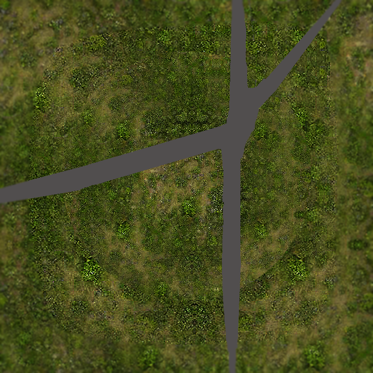
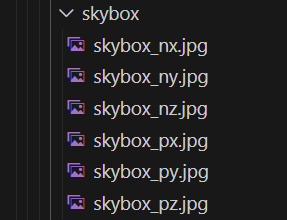
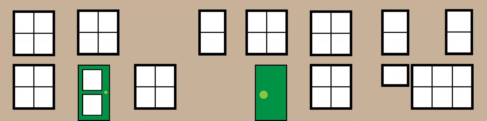
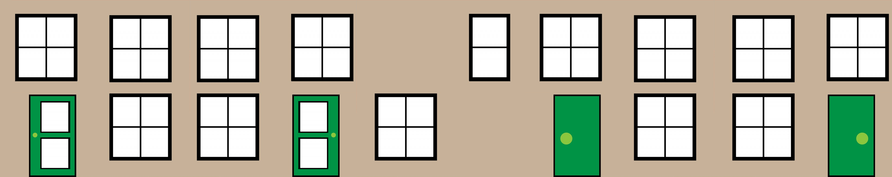
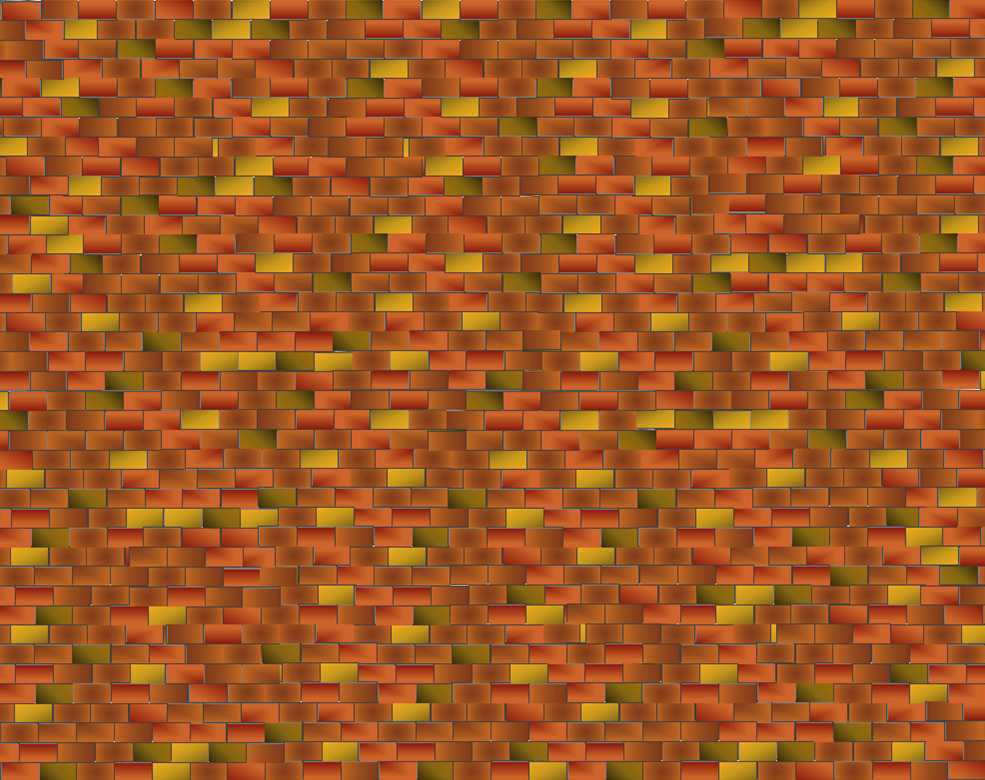

## Village Environment

To get accustomed to Babylon this section reflects sections the tutorial [building a village](https://doc.babylonjs.com/features/introductionToFeatures/chap2) but is presented in typescript.

The village is built up in stages.

The online tutorial includes a range of alternative methods of controlling the appearance of elements, so following through here should not replace reading through the full tutorial in the BabylonJS documentation. 

This section will form the basis for Element 2 in the scenes portfolio. 

This demonstrates terrain with a height map and sky box.  Some meshes are included reflecting the village tutorial.  Additional trees are placed as sprites.

The suggested file structure for assets is shown here.


The code in the src folder should be as below at the end of the development.


The index file links to the index.ts script.

**index.html**
```html
<!DOCTYPE html>
<html>
    <head>
        <meta charset="UTF-8">
        <title>Village Environment</title>
    </head>
    <body> </body>
</html>
<script type="module" src="./src/index.ts"></script>
```

The file **index.ts** runs the scene.

**index.ts**
```javascript
import { Engine} from "@babylonjs/core";
import createStartScene from "./createStartScene";
import createRunScene from "./createRunScene";
import "./main.css";

const CanvasName = "renderCanvas";

let canvas = document.createElement("canvas");
canvas.id = CanvasName;

canvas.classList.add("background-canvas");
document.body.appendChild(canvas);

let eng = new Engine(canvas, true, {}, true);
let startScene = createStartScene(eng);
createRunScene(startScene);

eng.runRenderLoop(() => {
  startScene.scene.render();
});
```

First the necessary resources are imported; the babylon Engine and the modules which will be written in createStartScene and createRunScene. Then a canvas is created in the HTML document object model.

An instance of the bablonjs engine is created and passed as a function to createStartScene(eng) which will create all the elements in the scene and return both the scene and these elements matching the SceneData interface defined in interfaces.d.ts.

The function createRunScene is then called.  This is done so that the visual elements can be described seperately from the scene actions.  In this case the createRunScene content will be minor because there is no action in the scene.

Finally, the scene is rendered within a loop at the default frame rate.

The scene uses assets downloaded from the BabylonJS documentation and the [assets library](https://github.com/BabylonJS/Assets).  The trees are sprites generated by generative AI.  You can download this image from this page.


The main content is in **createStartScene.ts**

The file imports the module resources it needs including the SceneData interface which is maintained to match the scene data set at the end of the createStartScene.ts file.

The import list of babylon core elements is built up gradually as items are added to the code.  

**createStartScene.ts**
```javascript
import { SceneData } from "./interfaces ";

import {
  Scene,
  ArcRotateCamera,
  Vector3,
  MeshBuilder,
  Mesh,
  StandardMaterial,
  HemisphericLight,
  Color3,
  Engine,
  Texture,
  CubeTexture,
  Nullable,
  Vector4,
  InstancedMesh,
  SpriteManager,
  Sprite
} from "@babylonjs/core";
```

A scene with hills and flat valley is created 

A standard material is created and a diffuse texture property is set to a texture of the valley ground.


The ground is created using a mesh builder which includes a height map. Where the lighter material appears as a higher contour. The affect of the height map is ajusted within the ```{options}```.


The largeGround material is then applied to the largeGround mesh.

The mesh is positioned at a small negative y position so that it is not coincident with the central square of ground material which will be added next.

```javascript
function createTerrain(scene: Scene) {
  //Create large ground for valley environment
  const largeGroundMat = new StandardMaterial("largeGroundMat");
  largeGroundMat.diffuseTexture = new Texture(
    "./assets/environments/valleygrass.png"
  );

  const largeGround = MeshBuilder.CreateGroundFromHeightMap(
    "largeGround",
    "./assets/environments/villageheightmap.png",
    {
      width: 150,
      height: 150,
      subdivisions: 20,
      minHeight: 0,
      maxHeight: 10,
    },
    scene
  );
  largeGround.material = largeGroundMat;
  largeGround.position.y = -0.01;
}
```

A central square of ground material is prepared to represent grass and has backFaceCulling set to false so that the ground is not transparent when viewed from below.

```javascript
function createGround(scene: Scene) {
  const groundMaterial = new StandardMaterial("groundMaterial");
  groundMaterial.diffuseTexture = new Texture(
    "./assets/environments/villagegreen.png"
  );
  groundMaterial.diffuseTexture.hasAlpha = true;
  groundMaterial.backFaceCulling = false;
  const ground = MeshBuilder.CreateGround(
    "ground",
    { width: 24, height: 24 },
    scene
  );
  ground.material = groundMaterial;
  ground.position.y = 0.01;
  return ground;
}
```

The ground material is created from a standardMaterial with a diffuse texture added from the village greem image.  This is positioned so that the image of roads line up.




The scene utilises a skybox based on a series of faces which make up a cube texture.



```javascript
function createSky(scene: Scene) {
  const skybox = MeshBuilder.CreateBox("skyBox", { size: 150 }, scene);
  const skyboxMaterial = new StandardMaterial("skyBox", scene);
  skyboxMaterial.backFaceCulling = false;
  skyboxMaterial.reflectionTexture = new CubeTexture(
    "./assets/textures/skybox/skybox",
    scene
  );
  skyboxMaterial.reflectionTexture.coordinatesMode =
    Texture.SKYBOX_MODE;
  skyboxMaterial.diffuseColor = new Color3(0, 0, 0);
  skyboxMaterial.specularColor = new Color3(0, 0, 0);
  skybox.material = skyboxMaterial;
  return skybox;
}
```
A house is based on a two meshes, a box for a house and a cylinder with three tessalations for a roof.  These are each decorated with materials for the walls and roof drawn from the assets library.

The house comes in two styles, a small house and a semi-detached pair of houses. These are created diffuse textures.

For the single house.



For the semi-detached pair of houses.



The roof is textured with slates.



A style parameter is passed to the function to create a single house or a pair of semi-detached houses.

The faceUV arrays are set to map points on the image which will represent the corners of faces of the boxes.

By passing a style parameter 1 or 2 the body of the house can be created as a small house or a larger semi-detached pair of houses.

```javascript
function createBox(style: number) {
  //style 1 small style 2 semi detatched
  const boxMat = new StandardMaterial("boxMat");
  const faceUV: Vector4[] = []; // faces for small house
  if (style == 1) {
    boxMat.diffuseTexture = new Texture("./assets/textures/cubehouse.png");
    faceUV[0] = new Vector4(0.5, 0.0, 0.75, 1.0); //rear face
    faceUV[1] = new Vector4(0.0, 0.0, 0.25, 1.0); //front face
    faceUV[2] = new Vector4(0.25, 0, 0.5, 1.0); //right side
    faceUV[3] = new Vector4(0.75, 0, 1.0, 1.0); //left side
    // faceUV[4] would be for bottom but not used
    // faceUV[5] would be for top but not used
  } else {
    boxMat.diffuseTexture = new Texture("./assets/textures/semihouse.png");
    faceUV[0] = new Vector4(0.6, 0.0, 1.0, 1.0); //rear face
    faceUV[1] = new Vector4(0.0, 0.0, 0.4, 1.0); //front face
    faceUV[2] = new Vector4(0.4, 0, 0.6, 1.0); //right side
    faceUV[3] = new Vector4(0.4, 0, 0.6, 1.0); //left side
    // faceUV[4] would be for bottom but not used
    // faceUV[5] would be for top but not used
  }
  
  const box = MeshBuilder.CreateBox("box", {
    width: style,
    height: 1,
    faceUV: faceUV,
    wrap: true,
  });
  box.position = new Vector3(0, 0.5, 0);
  box.scaling = new Vector3(1, 1, 1);
  box.material = boxMat;
  return box;
}
```

The roof is then created using a cylinder of tessellation value 3 to create a triangular section.

The style parameter is used to scale the roof to the correct size.

```javascript
function createRoof(style: number) {
  const roof = MeshBuilder.CreateCylinder("roof", {
    diameter: 1.3,
    height: 1.2,
    tessellation: 3,
  });
  roof.scaling.x = 0.75;
  roof.scaling.y = style * 0.85;
  roof.rotation.z = Math.PI / 2;
  roof.position.y = 1.22;
  const roofMat = new StandardMaterial("roofMat");
  roofMat.diffuseTexture = new Texture("./assets/textures/roof.jpg");
  roof.material = roofMat;
  return roof;
}
```

Note that the createBox and createRoof functions do not need to access the scene object.

The house is created by merging the roof and the house body.

The boxes are merged to create a single house and the mergeMeshes parameters are set to allow the use of multiple materials on the combined mesh.  If this is not set correctly then the first material is used for all faces.

```javascript
function createHouse(scene: Scene, style: number) {
  const box = createBox(style);
  const roof = createRoof(style);
  const house = Mesh.MergeMeshes(
    [box, roof],
    true,
    false,
    undefined,
    false,
    true
  );
  // last true allows combined mesh to use multiple materials
  return house;
}
```
A createHouses function is provided to call the singular createHouse function multiple times to create a street of houses.

If a style parameter is set to 1 then createHouse is passed the parameters to make a single house.  

If a style parameter is set to 2 then createHouse is passed the parameters to make a single semi detatched house.

If a style parameter i set to 3 then createHouse is called multiple times with varied parameters to mix semi and detached houses.

In the case of style 3 the two houses, one of each style, are initially placed into the scene at the required positions.

The other houses will be created as instances of the first two houses, and placed at the positions listed in the places array.

The orientation of the houses does not match the original tutorial so the graphic featuring the street at ground level is not used.  You can vary the house locations to suit your own preferences.

 Empty arrays are set up which will hold the house meshes for the two designs, instances of these meshes which will be placed on screen and location and type data to describe the estate layout.

 For each house required an entry is made in the places array which records the house type, rotation and position.

 The two models are saved in the houses array.

 Iterating through the places array, instances of the houses are loaded into the ihouses array and these are placed on screen.

```javascript
function createHouses(scene: Scene, style: number) {
  //Start by locating one each of the two house types then add others

  if (style == 1) {
    // show 1 small house
    createHouse(scene, 1);
  }
  if (style == 2) {
    // show 1 large house
    createHouse(scene, 2);
  }
  if (style == 3) {
    // show estate
    const houses: Nullable<Mesh>[] = [];
    // first two houses are original meshes
    houses[0] = createHouse(scene, 1);
    houses[0]!.rotation.y = -Math.PI / 16;
    houses[0]!.position.x = -6.8;
    houses[0]!.position.z = 2.5;

    houses[1] = createHouse(scene, 2);
    houses[1]!.rotation.y = -Math.PI / 16;
    houses[1]!.position.x = -4.5;
    houses[1]!.position.z = 3;

    //next houses are cloned instances of first two
    const ihouses: InstancedMesh[] = [];
    const places: number[][] = []; //each entry is an array [house type, rotation, x, z]

    places.push([2, -Math.PI / 16, -1.5, 4]);
    places.push([2, -Math.PI / 3, 1.5, 6]);
    places.push([2, (15 * Math.PI) / 16, -6.4, -1.5]);
    places.push([1, (15 * Math.PI) / 16, -4.1, -1]);
    places.push([2, (15 * Math.PI) / 16, -2.1, -0.5]);
    places.push([1, (5 * Math.PI) / 4, 0, -1]);
    places.push([1, Math.PI + Math.PI / 2.5, 0.5, -3]);
    places.push([2, Math.PI + Math.PI / 2.1, 0.75, -5]);
    places.push([1, Math.PI + Math.PI / 2.25, 0.75, -7]);
    places.push([2, Math.PI / 1.9, 4.75, -1]);
    places.push([1, Math.PI / 1.95, 4.5, -3]);
    places.push([2, Math.PI / 1.9, 4.75, -5]);
    places.push([1, Math.PI / 1.9, 4.75, -7]);
    places.push([2, -Math.PI / 3, 5.25, 2]);
    places.push([1, -Math.PI / 3, 6, 4]);

    for (let i = 0; i < places.length; i++) {
      if (places[i][0] === 1) {
        ihouses[i] = houses[0]!.createInstance("house" + i);
      } else {
        ihouses[i] = houses[1]!.createInstance("house" + i);
      }
      ihouses[i].rotation.y = places[i][1];
      ihouses[i].position.x = places[i][2];
      ihouses[i].position.z = places[i][3];
    }
  }
  // nothing returned by this function
}
```

I have chosen not to return anything from this function as the houses are added to the scene.  The houses will be visible in the scene but are not exposed to the rest of the program.

Trees are added from 2D images as sprites which always face the camera.  These are arranged randomly in two groves.

```javascript
function createTrees(scene: Scene) {
  const spriteManagerTrees = new SpriteManager(
    "treesManager",
    "./assets/sprites/tree.png",
    2000,
    { width: 512, height: 1024 },
    scene
  );

  //We create trees at random positions
  for (let i = 0; i < 500; i++) {
    const tree: Sprite = new Sprite("tree", spriteManagerTrees);
    tree.position.x = Math.random() * -30;
    tree.position.z = Math.random() * 20 + 8;
    tree.position.y = 0.2;
  }

  for (let i = 0; i < 500; i++) {
    const tree = new Sprite("tree", spriteManagerTrees);
    tree.position.x = Math.random() * 25 + 7;
    tree.position.z = Math.random() * -35 + 8;
    tree.position.y = 0.2;
  }
  // nothing returned by this function
}
```

A hemispheric light is used with a bit of added colour for diffuse, specular and ground surfaces.

```javascript
function createHemisphericLight(scene: Scene) {
  const light = new HemisphericLight(
    "light",
    new Vector3(2, 1, 0), // move x pos to direct shadows
    scene
  );
  light.intensity = 0.8;
  light.diffuse = new Color3(1, 1, 1);
  light.specular = new Color3(1, 0.8, 0.8);
  light.groundColor = new Color3(0, 0.2, 0.7);
  return light;
}
```

An arcRotateCamera is added, but its position and rotation is limitted so that the motion of the camera cannot spoil the appearance of the scene by moving the camera below the ground.  The camera is also constrained so that it can't pull back too far from the scene.

```javascript
function createArcRotateCamera(scene: Scene) {
  let camAlpha = -Math.PI / 2,
    camBeta = Math.PI / 2.5,
    camDist = 25,
    camTarget = new Vector3(0, 0, 0);
  let camera = new ArcRotateCamera(
    "camera1",
    camAlpha,
    camBeta,
    camDist,
    camTarget,
    scene
  );
  camera.lowerRadiusLimit = 9;
  camera.upperRadiusLimit = 25;
  camera.lowerAlphaLimit = 0;
  camera.upperAlphaLimit = Math.PI * 2;
  camera.lowerBetaLimit = 0;
  camera.upperBetaLimit = Math.PI / 2.02;

  camera.attachControl(true);
  return camera;
}
```
Finally, a createScene function draws the elements together and these are stored into a data structure defined by the SceneData interface.

```javascript
export default function createStartScene(engine: Engine) {
  let scene   = new Scene(engine);
  let ground  = createGround(scene);
  let sky     = createSky(scene);
  let lightHemispheric = createHemisphericLight(scene);
  createHouses(scene, 3);
  createTrees(scene);
  createTerrain(scene);
  let camera  = createArcRotateCamera(scene);


  let that: SceneData = {
    scene,
    ground,
    sky,
    lightHemispheric,
    camera
  };
  return that;
}
```

It is essential that the description of the sceneData in interfaces.d.ts matches the description in createStartScenes perfectly.

**interfaces.d.ts**
```javascript
import {
  Scene,
  Mesh,
  HemisphericLight,
  Camera,
} from "@babylonjs/core";

export interface SceneData {
  scene: Scene;
  ground: Mesh;
  sky: Mesh;
  lightHemispheric: HemisphericLight;
  camera: Camera;
}
```

The file createRunScene in this example is really only a placeholder as there is no action added into this scene.

**createRunScene.ts**
```javascript
import {} from "@babylonjs/core";

import { SceneData } from "./interfaces ";

export default function createRunScene(runScene: SceneData) {
 

  runScene.scene.onAfterRenderObservable.add(() => {});
}
```

Then with all of this in place the scene will appear as:

<iframe 
    height="600" 
    width="100%" 
    scrolling="no" 
    title="shapes" 
    src="Block_3/section_5/distrib/index.html" 
    frameborder="no" 
    loading="lazy" 
    allowtransparency="true" 
    allowfullscreen="true">
</iframe>

