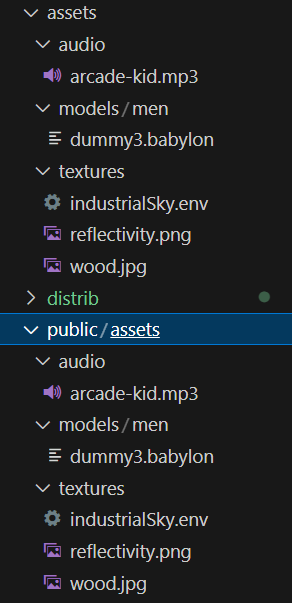
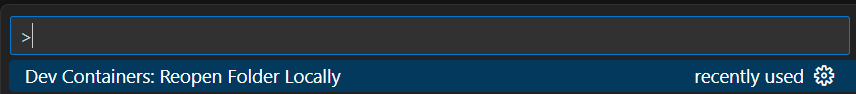
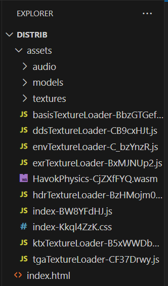
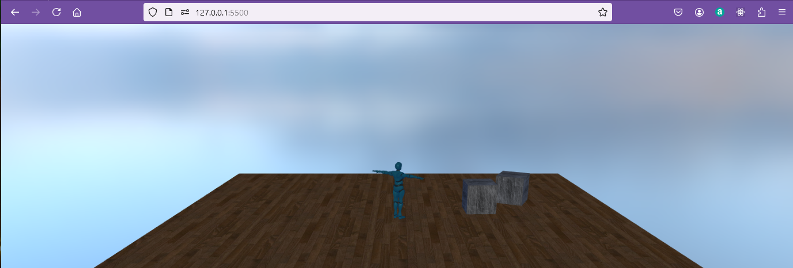
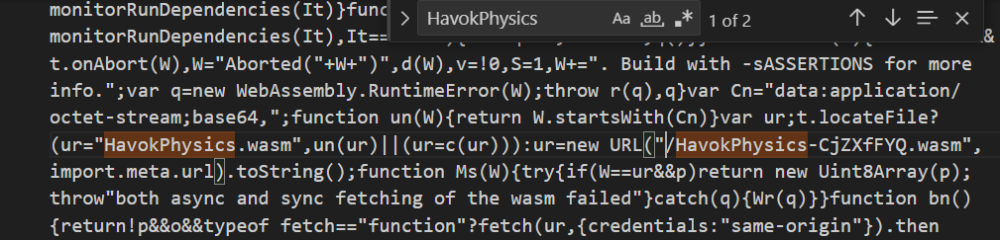
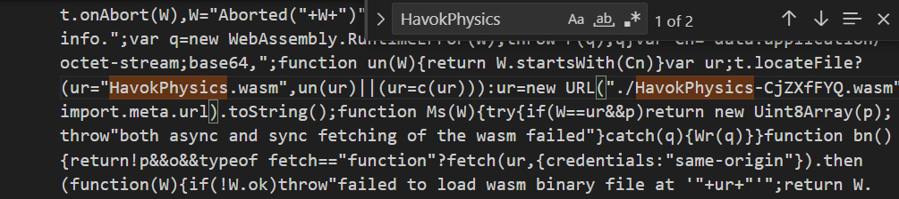

# Building with Havok


In order to build a version of code for distribution we have been running scripts in the **babylonproj/package.json** file.

**babylonproj/package.json extract**
```json
    "motion03build": "tsc && vite build motion03",
    "motion03preview": "vite preview motion03 --host",
```
Using a command of the form

> npm run motion03build

This has worked so far, but the introduction of havok creates a new situation and ajustments need to be made.

I don't know if every step here is strictly necessary but  following these enables the collision03 scene to be built.

## 1. vite configuration ##

It has already been noted that the havok files are loaded to the node modules in the root folder which I called BabylonJSdev.

To allow vite to reference these on build the vite.config.js file needs to be adjusted to

```javascript
// vite.config.js
export default {
    // config options
    server: {
        fs: {
          // Allow serving files outside of the root
          allow: [
            "../.."
          ]
        }
      },
    optimizeDeps: { exclude: ["@babylonjs/havok"] }
}
 

// https://forum.babylonjs.com/t/importing-and-implementing-havok-in-vite-react-ts-project-fails/48441/4
```

However this is not sufficient as there is another problem.  Havok uses a javascript feature "top level await" which is not available in all browsers so the configuration file must be ammended to target up to date browsers using esNext which support top-level-await.

```javascript
// vite.config.ts
import { defineConfig } from "vite";
export default defineConfig({
  // config options
  server: {
    fs: {
      // Allow serving files outside of the root
      allow: ["../.."],
    },
  },
  optimizeDeps: {
    exclude: ["@babylonjs/havok"],
    esbuildOptions: {
      target: "esnext",
      supported: {
        'top-level-await': true //browsers can handle top-level-await features
        }
    },
  },
  build: {
    target: "esnext",
  },
  esbuild: {
    target: "esnext",
    supported: {
      'top-level-await': true //browsers can handle top-level-await features
      }
  },
});

// https://forum.babylonjs.com/t/importing-and-implementing-havok-in-vite-react-ts-project-fails/48441/4
```

For vite to read this target at build time the configuration code must be placed in the folder which is being built.  So it must be placed inside collisions03 appearing below the index.html file.  (This will need to be done for any scene where havok is used).


## 2. Dodge typescript compiler ##

Typescript can be built by either vite or the typescript compiler.  To be sure that the correct target is addressed the compilation will be handed over to vite and not typescript.

Vite does not check types when it compiles, it assumes that this has been done in the development stage, and so it runs quicker than the typescript compiler.

The tsconfig.json file is in the babylonProj folder applying to all the subfolders.  It does not need to be moved.  Just add the compiler option "noEmit":true.  

Then **babylonproj/tsconfig.json (full listing)** becomes:

**babylonproj/tsconfig.json (full listing)**
```json
{
    "compilerOptions": {
      "target": "ESNext", // choose our ECMA/JavaScript version (all modern browsers support ES6 so it's your best bet)
      "lib": [ // choose our default ECMA/libraries to import
        "dom", // mandatory for all browser-based apps
        "es6" // mandatory for targeting ES6
      ],
      "useDefineForClassFields": true, // enable latest ECMA runtime behavior with older ECMA/JavaScript versions (delete this line if target: "ESNext" or "ES2022"+)
      "module": "ESNext", // use the latest ECMA/JavaScript syntax for our import statements and such
      "moduleResolution": "node", // ensures we are using CommonJS for our npm packages
      "noResolve": false, // disable TypeScript from automatically detecting/adding files based on import statements and etc (it's less helpful than you think)
      "isolatedModules": true, // allows our code to be processed by other transpilers, such as preventing non-module TS files (you could delete this since we're only using base TypeScript)
      "removeComments": true, // remove comments from our outputted code to save on space (look into terser if you want to protect the outputted JS even more)
      "esModuleInterop": true, // treats non-ES6 modules separately from ES6 modules (helpful if module: "ESNext")
      "noImplicitAny": false, // usually prevents code from using "any" type fallbacks to prevent untraceable JS errors, but we'll need this disabled for our example code
      "noUnusedLocals": false, // usually raises an error for any unused local variables, but we'll need this disabled for our example code
      "noUnusedParameters": true, // raises an error for unused parameters
      "noImplicitReturns": true, // raises an error for functions that return nothing
      "skipLibCheck": true, // skip type-checking of .d.ts files (it speeds up transpiling)
      // Vite takes care of building everything, not tsc.
      "noEmit": true, // disable TypeScript from emitting any JS files (we'll be using Vite for that)
    },
    "include": ["src"] // specify location(s) of .ts files
  }
```  
The script call in package json does not need tsc and so can become:

** babylonproj/package.json (extract) **
```json
    "collision03build": "vite build collision03v2",
    "collision03preview": "vite preview collision03v2 --host",
```
## 3. Copy assets to public folder ##

It may seem wasteful but you need to make a complete copy of the assets file structure inside the public folder.




## Build

The build script is now run by:

> npm run collision03build

The output during the buld will then look like:


```bash
$ npm run collision03build

> testproj@0.0.0 collision03build
> vite build collision03

vite v5.4.10 building for production...
✓ 1816 modules transformed.
dist/index.html                                 0.32 kB │ gzip:     0.23 kB
dist/assets/HavokPhysics-CjZXfFYQ.wasm      2,097.08 kB
dist/assets/index-Kkql4ZzK.css                  0.10 kB │ gzip:     0.10 kB
dist/assets/tgaTextureLoader-CF37Drwy.js        0.31 kB │ gzip:     0.26 kB
dist/assets/hdrTextureLoader-BzHMojm0.js        0.53 kB │ gzip:     0.38 kB
dist/assets/envTextureLoader-C_bzYnzR.js        0.55 kB │ gzip:     0.37 kB
dist/assets/basisTextureLoader-BbzGTGef.js      1.19 kB │ gzip:     0.57 kB
dist/assets/ddsTextureLoader-CB9cxHJt.js        1.22 kB │ gzip:     0.59 kB
dist/assets/ktxTextureLoader-B5xWWDbg.js        1.38 kB │ gzip:     0.71 kB
dist/assets/exrTextureLoader-BxMJNUp2.js        6.52 kB │ gzip:     2.53 kB
dist/assets/index-BW8YFdHJ.js               5,003.56 kB │ gzip: 1,122.90 kB

(!) Some chunks are larger than 500 kB after minification. Consider:
- Using dynamic import() to code-split the application
- Use build.rollupOptions.output.manualChunks to improve chunking: https://rollupjs.org/configuration-options/#output-manualchunks
- Adjust chunk size limit for this warning via build.chunkSizeWarningLimit.
✓ built in 50.60s
```

The warnings over chunk sizing are familiar and we will just accept the chunks as they are.

The result of the build will now be in the dist folder.  To see this you will need to refresh the VSC view.

The dist folder will appear grayed out which is an indication that it will not be saved to github.  If you want to keep it on github you need to rename it to "distribution" or any other name you choose.

To get this out of the container running vite you should reopen the files in a local folder.

> CTRL + SHIFT + P



## Use stand-alone

Then use the file explorer to take a copy of the "dist" folder to the desktop or whatever directory you are using.

Open this new stand-alone copy of the folder in VSCode.

The file structure will include some randonly named files.



The index.html file will read:

** index.html **

```html
<!DOCTYPE html>
<html>
    <head>
        <meta charset="UTF-8">
        <title>Collision with havok physics</title>
      <script type="module" crossorigin src="/assets/index-BW8YFdHJ.js"></script>
      <link rel="stylesheet" crossorigin href="/assets/index-Kkql4ZzK.css">
    </head>
    <body> </body>
</html>
```

This was the correct location when the files were in the original dist folder.  However now they are moved relative addressing should be used by adding ./ before assets/ thus:

** index.html **

```html
<!DOCTYPE html>
<html>
    <head>
        <meta charset="UTF-8">
        <title>Collision with havok physics</title>
      <script type="module" crossorigin src="./assets/index-BW8YFdHJ.js"></script>
      <link rel="stylesheet" crossorigin href="./assets/index-Kkql4ZzK.css">
    </head>
    <body> </body>
</html>
```

The index.html file can then be viewed in live server.



The file runs and the physics works.

## iframe  

In order to include working examples in these web page notes I am using iframes.  An example from the previous collisions page would be:

```html
<iframe 
    height="460" 
    width="100%" 
    scrolling="no" 
    title="Box collider" 
    src="Block_3/section_7collisions/distrib/index.html" 
    frameborder="no" 
    loading="lazy" 
    allowtransparency="true" 
    allowfullscreen="true">
</iframe>
```

This did not work initially and on inspection it was because the wasm file was not being loaded.

I needed to go into the file index-BW8YFdJJ.js which was linked from index.html and search for "havokPhysics".



Add a dot before the url address to use relative addressing.



The iframe then works - you can see this working on the previuous page "collisions"

No doubt in time the use of havok will become smoother, but for now you need to follow this process for any project which uses havok physics.